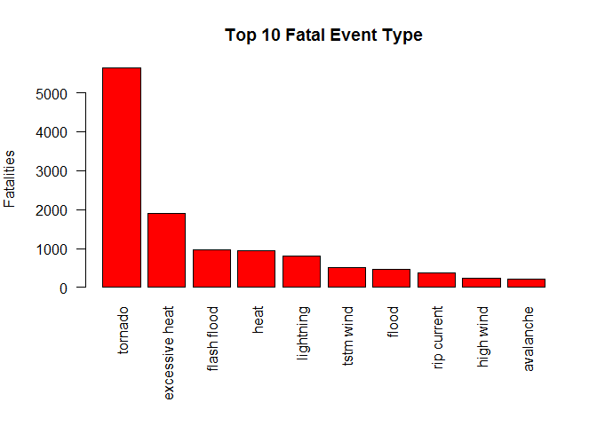
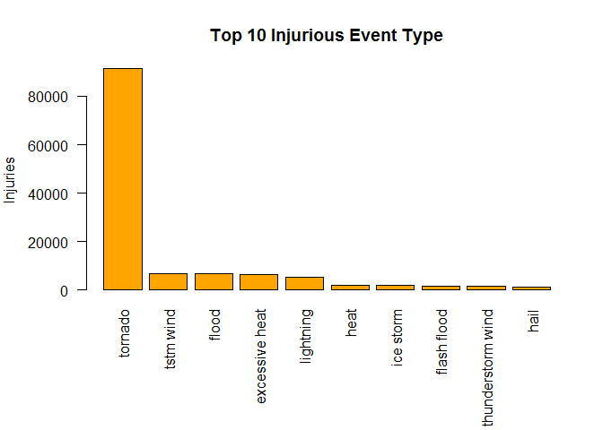
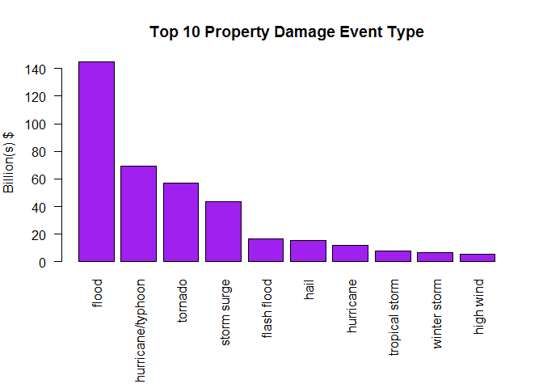
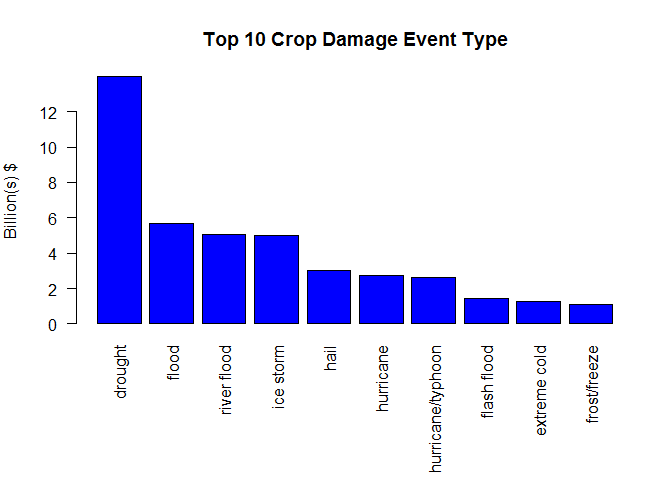
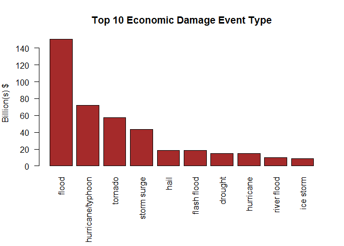

# Impact Of Major Storms And Weather Events To Public Health And Economy In The United States 
Tuong Nguyen  
March 28, 2017  


## Synopsis
Storm and other severe weather events can cause both public health and economic problems for communities and municipalities. Many severs events can results in fatalities, injuries and property damage. The U.S. National Oceanic and Atmospheric Administration's (NOAA) storm database tracks events of 985 weather event types from 1950 to 2011. This report explores the events types that have the most harmful impact on public health and economy. In order to achieve this, we will look at the event types that have caused the most fatalities, the most injuries and the worst economic consequences.


#Data Processing

### Download and load data into a dataframe 

```r
# download StormData.bz2 file
if (!file.exists('StormData.bz2')) {
    download.file(url = 'https://d396qusza40orc.cloudfront.net/repdata%2Fdata%2FStormData.csv.bz2', 
                  destfile = 'StormData.bz2')
}

# unzip file
if (!file.exists('StormData.csv')) {
    library(R.utils)
    bunzip2('StormData.bz2', 'StormData.csv', remove = FALSE)
}

# Read data into R dataframe
if (!exists('StormData')) { StormData <- read.csv('StormData.csv') }

print(head(StormData,2),row.names = FALSE)
```

```
##  STATE__          BGN_DATE BGN_TIME TIME_ZONE COUNTY COUNTYNAME STATE
##        1 4/18/1950 0:00:00     0130       CST     97     MOBILE    AL
##        1 4/18/1950 0:00:00     0145       CST      3    BALDWIN    AL
##   EVTYPE BGN_RANGE BGN_AZI BGN_LOCATI END_DATE END_TIME COUNTY_END
##  TORNADO         0                                               0
##  TORNADO         0                                               0
##  COUNTYENDN END_RANGE END_AZI END_LOCATI LENGTH WIDTH F MAG FATALITIES
##          NA         0                        14   100 3   0          0
##          NA         0                         2   150 2   0          0
##  INJURIES PROPDMG PROPDMGEXP CROPDMG CROPDMGEXP WFO STATEOFFIC ZONENAMES
##        15    25.0          K       0                                    
##         0     2.5          K       0                                    
##  LATITUDE LONGITUDE LATITUDE_E LONGITUDE_ REMARKS REFNUM
##      3040      8812       3051       8806              1
##      3042      8755          0          0              2
```
### Select and process variables/fields that are used for this analysis 

```r
ProcessedData <- transmute(StormData,EventType = EVTYPE, 
                           Fatalities = FATALITIES, Injuries = INJURIES, 
                           PropertyDamage = PROPDMG,PropertyDamageExp = PROPDMGEXP,
                           CropDamage = CROPDMG, CropDamageExp = CROPDMGEXP)

ProcessedData$PropertyExp[ProcessedData$PropertyDamageExp == "+"]   <- 0
ProcessedData$PropertyExp[ProcessedData$PropertyDamageExp == "-"]   <- 0
ProcessedData$PropertyExp[ProcessedData$PropertyDamageExp == "?"]   <- 0
ProcessedData$PropertyExp[ProcessedData$PropertyDamageExp == "" ]   <- 1
ProcessedData$PropertyExp[ProcessedData$PropertyDamageExp == "0"]   <- 1e0
ProcessedData$PropertyExp[ProcessedData$PropertyDamageExp == "1"]   <- 1e1
ProcessedData$PropertyExp[ProcessedData$PropertyDamageExp == "2"]   <- 1e2
ProcessedData$PropertyExp[ProcessedData$PropertyDamageExp == "3"]   <- 1e3
ProcessedData$PropertyExp[ProcessedData$PropertyDamageExp == "4"]   <- 1e4
ProcessedData$PropertyExp[ProcessedData$PropertyDamageExp == "5"]   <- 1e5
ProcessedData$PropertyExp[ProcessedData$PropertyDamageExp == "6"]   <- 1e6
ProcessedData$PropertyExp[ProcessedData$PropertyDamageExp == "7"]   <- 1e7
ProcessedData$PropertyExp[ProcessedData$PropertyDamageExp == "8"]   <- 1e8
ProcessedData$PropertyExp[ProcessedData$PropertyDamageExp == "h"]   <- 1e2
ProcessedData$PropertyExp[ProcessedData$PropertyDamageExp == "H"]   <- 1e2
ProcessedData$PropertyExp[ProcessedData$PropertyDamageExp == "k"]   <- 1e3
ProcessedData$PropertyExp[ProcessedData$PropertyDamageExp == "K"]   <- 1e3
ProcessedData$PropertyExp[ProcessedData$PropertyDamageExp == "m"]   <- 1e6
ProcessedData$PropertyExp[ProcessedData$PropertyDamageExp == "M"]   <- 1e6
ProcessedData$PropertyExp[ProcessedData$PropertyDamageExp == "b"]   <- 1e9
ProcessedData$PropertyExp[ProcessedData$PropertyDamageExp == "B"]   <- 1e9


ProcessedData$CropExp[ProcessedData$CropDamageExp == "+"]   <- 0
ProcessedData$CropExp[ProcessedData$CropDamageExp == "-"]   <- 0
ProcessedData$CropExp[ProcessedData$CropDamageExp == "?"]   <- 0
ProcessedData$CropExp[ProcessedData$CropDamageExp == "" ]   <- 1
ProcessedData$CropExp[ProcessedData$CropDamageExp == "0"]   <- 1e0
ProcessedData$CropExp[ProcessedData$CropDamageExp == "1"]   <- 1e1
ProcessedData$CropExp[ProcessedData$CropDamageExp == "2"]   <- 1e2
ProcessedData$CropExp[ProcessedData$CropDamageExp == "3"]   <- 1e3
ProcessedData$CropExp[ProcessedData$CropDamageExp == "4"]   <- 1e4
ProcessedData$CropExp[ProcessedData$CropDamageExp == "5"]   <- 1e5
ProcessedData$CropExp[ProcessedData$CropDamageExp == "6"]   <- 1e6
ProcessedData$CropExp[ProcessedData$CropDamageExp == "7"]   <- 1e7
ProcessedData$CropExp[ProcessedData$CropDamageExp == "8"]   <- 1e8
ProcessedData$CropExp[ProcessedData$CropDamageExp == "h"]   <- 1e2
ProcessedData$CropExp[ProcessedData$CropDamageExp == "H"]   <- 1e2
ProcessedData$CropExp[ProcessedData$CropDamageExp == "k"]   <- 1e3
ProcessedData$CropExp[ProcessedData$CropDamageExp == "K"]   <- 1e3
ProcessedData$CropExp[ProcessedData$CropDamageExp == "m"]   <- 1e6
ProcessedData$CropExp[ProcessedData$CropDamageExp == "M"]   <- 1e6
ProcessedData$CropExp[ProcessedData$CropDamageExp == "b"]   <- 1e9
ProcessedData$CropExp[ProcessedData$CropDamageExp == "B"]   <- 1e9

print(head(ProcessedData,5),row.names = FALSE)
```

```
##  EventType Fatalities Injuries PropertyDamage PropertyDamageExp CropDamage
##    TORNADO          0       15           25.0                 K          0
##    TORNADO          0        0            2.5                 K          0
##    TORNADO          0        2           25.0                 K          0
##    TORNADO          0        2            2.5                 K          0
##    TORNADO          0        2            2.5                 K          0
##  CropDamageExp PropertyExp CropExp
##                       1000       1
##                       1000       1
##                       1000       1
##                       1000       1
##                       1000       1
```


### Calculate property and crop damage values ($)

```r
ProcessedData <- ProcessedData %>% 
    mutate(PropertyDamageValue = PropertyDamage * PropertyExp, 
           CropDamageValue = CropDamage * CropExp) %>%
    select(EventType,Fatalities,Injuries,PropertyDamageValue,CropDamageValue)

print(head(ProcessedData,5),row.names = FALSE)
```

```
##  EventType Fatalities Injuries PropertyDamageValue CropDamageValue
##    TORNADO          0       15               25000               0
##    TORNADO          0        0                2500               0
##    TORNADO          0        2               25000               0
##    TORNADO          0        2                2500               0
##    TORNADO          0        2                2500               0
```


### Calculate total damage cause by each type of event

```r
DamageByEventType <- group_by(ProcessedData,EventType) %>%
    summarise(Fatalities = sum(Fatalities),
              Injuries = sum(Injuries),
              PropertyDamageValue = sum(PropertyDamageValue),
              CropDamageValue = sum(CropDamageValue)) %>% 
    data.table() %>% 
    mutate(EconomicDamageValue = PropertyDamageValue + CropDamageValue)
```


#Results

### Across the United States, which types of events are most harmful with respect to population health?

The most harmful weather event to population health is tornado. It has caused the highest fatalities (5633) and the highest injuries (91346) across the United States from 1950 to 2011. Excessive heat and flood also in the top three event types that are most harmfult to population health.


```r
Top10Fatal <- select(DamageByEventType,EventType,Fatalities) %>%
     arrange(desc(Fatalities)) %>% slice(1:10)

par(mar=c(8,5,4,2))
barplot(Top10Fatal$Fatalities,names.arg = tolower(Top10Fatal$EventType),
        col = 'red',las=2, main='Top 10 Fatal Event Type')
mtext(side=2, text="Fatalities", line=4)
```

<!-- -->

```r
Top10Injury <- select(DamageByEventType,EventType,Injuries) %>%
     arrange(desc(Injuries)) %>% slice(1:10)

par(mar=c(8,5,4,2))
barplot(Top10Injury$Injuries,names.arg = tolower(Top10Injury$EventType),
        col = 'orange',las=2, main='Top 10 Injurious Event Type')
mtext(side=2, text='Injuries', line=4)
```

<!-- -->


### Across the United States, which types of events have the greatest economic consequences?

Across the United States, flood has caused the greatest damage to properties (144.7 billions USD) and drought has caused the most damage to the crops (14 billions USD). In general, weather events caused much more ecnomic damage to property than to crop. 


```r
Top10PropertyDamage <- select(DamageByEventType,EventType,PropertyDamageValue) %>%
    arrange(desc(PropertyDamageValue)) %>% slice(1:10) %>% 
    mutate(PropertyDamageValue = PropertyDamageValue/1e9)
par(mar=c(8,4,4,2))
barplot(Top10PropertyDamage$PropertyDamageValue,
        names.arg = tolower(Top10PropertyDamage$EventType),
        col = 'purple',las=2, main='Top 10 Property Damage Event Type')
mtext(side=2, text='Billion(s) $', line=3)
```

<!-- -->

```r
Top10CropDamage <- select(DamageByEventType,EventType,CropDamageValue) %>%
    arrange(desc(CropDamageValue)) %>% slice(1:10) %>% 
    mutate(CropDamageValue = CropDamageValue/1e9)
par(mar=c(8,4,4,2))
barplot(Top10CropDamage$CropDamageValue,
        names.arg = tolower(Top10CropDamage$EventType),
        col = 'blue',las=2, main='Top 10 Crop Damage Event Type')
mtext(side=2, text='Billion(s) $', line=3)
```

<!-- -->

```r
Top10EconomicDamage <- select(DamageByEventType,EventType,EconomicDamageValue) %>%
    arrange(desc(EconomicDamageValue)) %>% slice(1:10) %>%
    mutate(EconomicDamageValue = EconomicDamageValue/1e9)
par(mar=c(8,4,4,2))
barplot(Top10EconomicDamage$EconomicDamageValue,
        names.arg = tolower(Top10EconomicDamage$EventType),
        col = 'brown',las=2, main='Top 10 Economic Damage Event Type')
mtext(side=2, text='Billion(s) $', line=3)
```

<!-- -->

